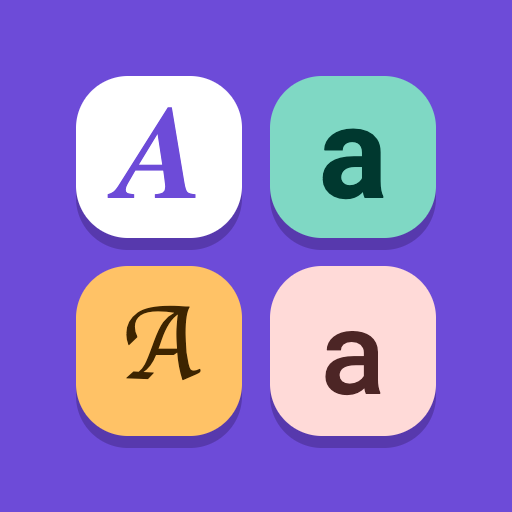
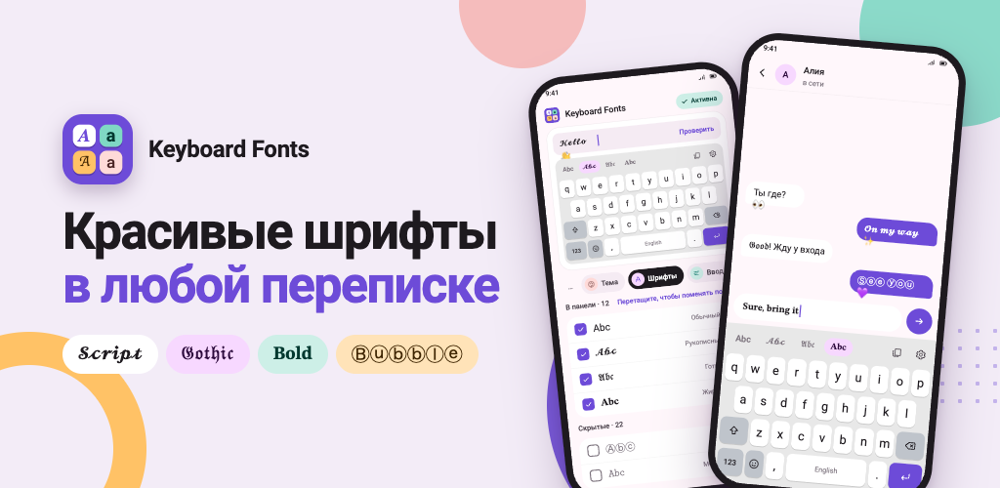
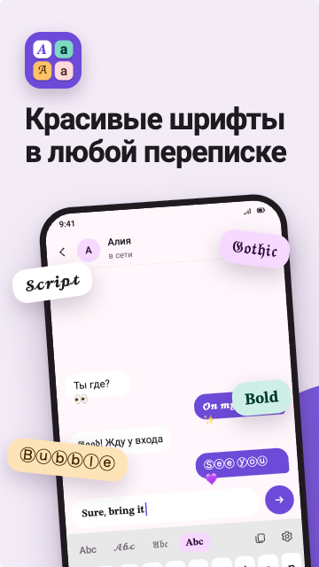
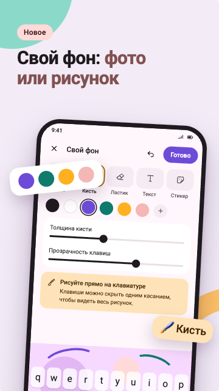
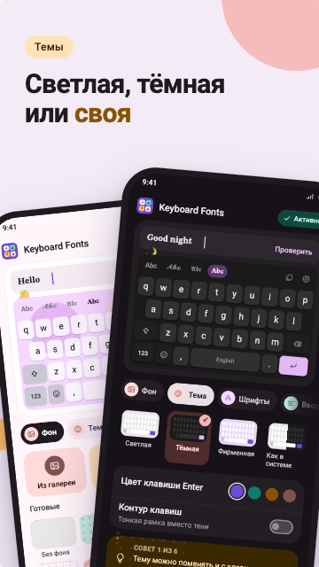
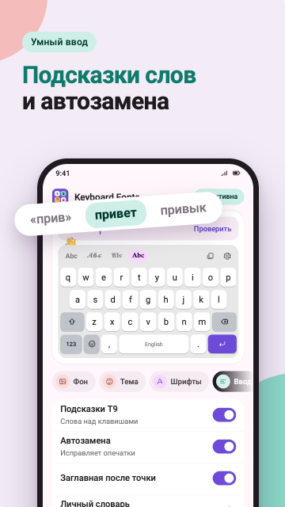
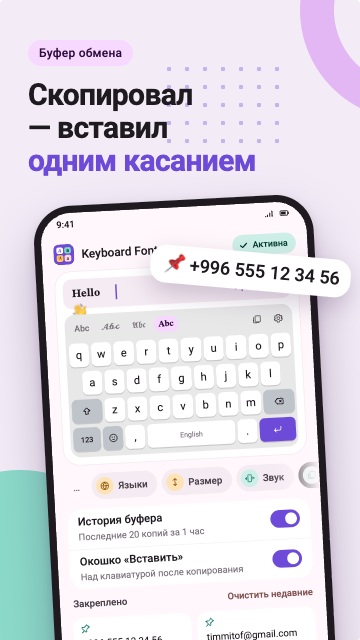
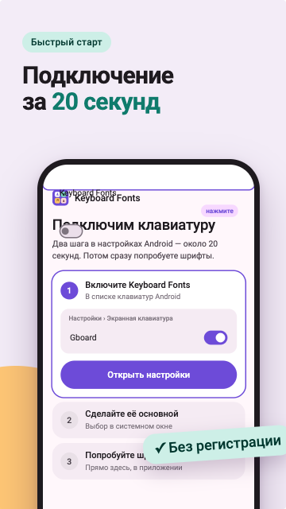

  

<h1 align="center">KeyboardFonts</h1>

  

  

## О приложении

Keyboard Fonts заменяет стандартную клавиатуру и позволяет писать стилизованным текстом в любом приложении: в мессенджерах, соцсетях, заметках. Шрифт выбирается прямо над клавишами, в одно касание, без копирования текста из сторонних генераторов.

- Без регистрации и аккаунта
- Не запрашивает доступ в интернет
- Подключение за два шага

<table>
  <tr>
    <td></td>
    <td></td>
    <td></td>
  </tr>
  <tr>
    <td align="center">Шрифты в переписке</td>
    <td align="center">Свой фон</td>
    <td align="center">Темы</td>
  </tr>
  <tr>
    <td></td>
    <td></td>
    <td></td>
  </tr>
  <tr>
    <td align="center">Умный ввод</td>
    <td align="center">Буфер обмена</td>
    <td align="center">Быстрый старт</td>
  </tr>
</table>

## Возможности

### Шрифты
- Множество стилей для ввода
- Панель стилей над клавишами: шрифт меняется в одно касание
- Порядок стилей настраивается перетаскиванием, ненужные можно скрыть

### Оформление
- Свой фон: фото из галереи с кадрированием, цвет или узоры
- Цвета клавиш подбираются под фон автоматически, при желании задаются вручную
- Темы: светлая, тёмная или как в системе
- Отдельные цвета для букв, служебных клавиш и Enter, контур вместо тени

### Умный ввод
- Клавиатура учится на вашем тексте: новые слова запоминаются сами
- Подсказки слов (T9) и автозамена опечаток для русского и английского
- Подсказка следующего слова
- Всё работает на устройстве, без отправки текста на сервер

### Буфер обмена
- История скопированного доступна прямо с клавиатуры
- Важные записи можно закрепить

### Удобство
- Свайп по пробелу меняет язык, зажатый пробел двигает курсор
- Зажатый ⌫ со сдвигом влево выделяет слова для удаления
- Долгое нажатие на букву открывает похожие символы
- Редактируемая высота клавиатуры, цифровой ряд над буквами
- Звуки клавиш, вибрация

## Технологии

| | |
|---|---|
| Язык | Kotlin 2.2, Coroutines, Flow |
| UI | Jetpack Compose, Material 3 Expressive |
| Архитектура | Clean Architecture, multi module architecture, MVI (Orbit) |
| DI | Hilt |
| Данные | Room, DataStore |
| Сборка | Gradle Kotlin DSL, Version Catalog, convention-plugins, KSP |
| Платформа | Android 7.0+ (minSdk 24), targetSdk 36 |

[GitHub](https://github.com/timmitof) · [Google Play](https://play.google.com/store/apps/details?id=kg.timmitof.keyboardfonts)
